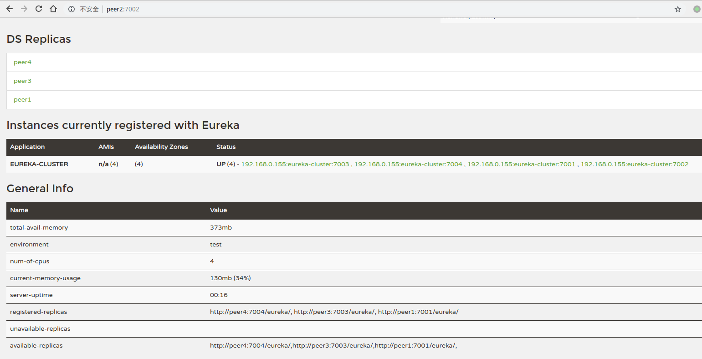

Eureka Server的HA基础环境搭建，参考[官方文档](http://projects.spring.io/spring-cloud/spring-cloud.html#_high_availability_zones_and_regions)

这里面说的不够详细，本文做些补充说明。

其实，可以参考Zookeeper的集群配置形式，只是两者之间的本质不同，因为ZK存在Leader选举机制，所以集群要有2N+1个节点，然后由Leader负责数据的同步，但是Eureka各个节点是独立的，内部通过Eureka Client订阅变更，并保证最终的数据一致，一旦Eureka集群运行起来，任一节点可以随时挂掉，随时拉起，除非全部同时扑街，所以可以保证服务注册中心的高可用。

## 集群配置

假设本集群包含4个节点，分别是peer1-peer4，这里节点标识可以是域名或IP，看项目需求，配置如下：

```yaml
spring:
  application:
    name: eureka-cluster
---
spring:
  profiles: peer1
eureka:
  instance:
    hostname: peer1
  client:
    serviceUrl:
      defaultZone: http://peer1:7001/eureka/,http://peer2:7002/eureka/,http://peer3:7003/eureka/,http://peer4:7004/eureka/
server:
  port: 7001

---
spring:
  profiles: peer2
eureka:
  instance:
    hostname: peer2
  client:
    serviceUrl:
      defaultZone: http://peer1:7001/eureka/,http://peer2:7002/eureka/,http://peer3:7003/eureka/,http://peer4:7004/eureka/
server:
  port: 7002

---
spring:
  profiles: peer3
eureka:
  instance:
    hostname: peer3
  client:
    serviceUrl:
      defaultZone: http://peer1:7001/eureka/,http://peer2:7002/eureka/,http://peer3:7003/eureka/,http://peer4:7004/eureka/
server:
  port: 7003
---
spring:
  profiles: peer4
eureka:
  instance:
    hostname: peer4
  client:
    serviceUrl:
      defaultZone: http://peer1:7001/eureka/,http://peer2:7002/eureka/,http://peer3:7003/eureka/,http://peer4:7004/eureka/
server:
  port: 7004
```

从上面的配置可以看出，peer1-peer4除了启动自己的服务节点外，还订阅了包含自己在内的所有服务节点（这时本节点是作为客户端），保证任一节点的数据变更都可以同步到本地节点。这是高可用的关键所在！


## 客户端配置
```yaml
eureka:
  client:
    serviceUrl:
      defaultZone: http://peer1:7001/eureka/,http://peer2:7002/eureka/,http://peer3:7003/eureka/,http://peer4:7004/eureka/
```

因为客户端不知道哪一个节点在什么时候可用，所以需要配置知道的所有服务节点，这个有点坑，不方便后继的升级维护；

## 集群运行

运行以下命令分别启动4个节点：
```bash
java -jar eureka_cluster-0.1.jar --spring.profiles.active=peer1
java -jar eureka_cluster-0.1.jar --spring.profiles.active=peer2
java -jar eureka_cluster-0.1.jar --spring.profiles.active=peer3
java -jar eureka_cluster-0.1.jar --spring.profiles.active=peer4
```

服务启动过程中可能会发生连接其它节点错误的信息，这个不同担心，等各节点都启动完成后，会自动恢复；

这时，我们访问其中的任一节点，以peer2为例：


从上图可以看出以下信息：

- DS Replicas区域，列出了另外三个节点，说明这4个节点之间的数据是互相同步的；

- 下面的服务实例信息中列出有eureka-cluster应用下我们发布的4个服务节点，全部正常；

- 下面的registered-replicas和available-replicas同样也列出了其它3个节点信息；


## 集群维护
至此，一个高可用的Eureka Server集群即搭建完成，如果担心4个节点不够，可以任意增加节点，但是需要修改已有节点的配置文件，以让它订阅新增的服务节点，这个动作并不影响系统的稳定运行，因为此种组网下，断掉任一节点其它节点可以正常提供服务。

本集群高可用的根本在于，各个节点之间的网状结构，任一节点都知晓其它所有服务节点，这是关键。

不过，一般情况下不建议部署太多的Eureka Server，建议3-5个即可，极端情况下再具体分析，而且部署的节点最好物理分散，防止地域影响。

## 其它方案
也可以采用DNS方案，将多个服务映射到同一个域名地址和固定端口；

这种方案的好处是客户端配置可以固定，比如固定为：http://my-eureka-cluster.xx.com:7001/eureka，而不需要知道具体有多少台服务节点，而且服务节点的增减可以透明控制；

而且，服务节点之间也通过域名交互，新增一个节点时，只需要增加域名映射，而不需要重新配置已有的服务节点；